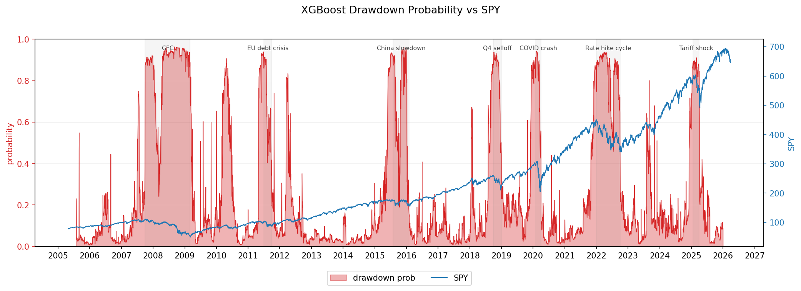
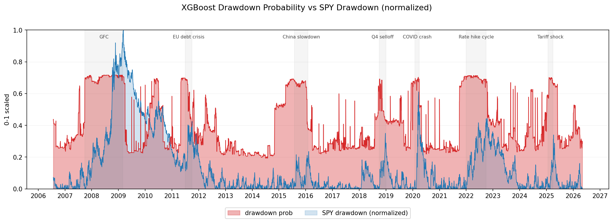
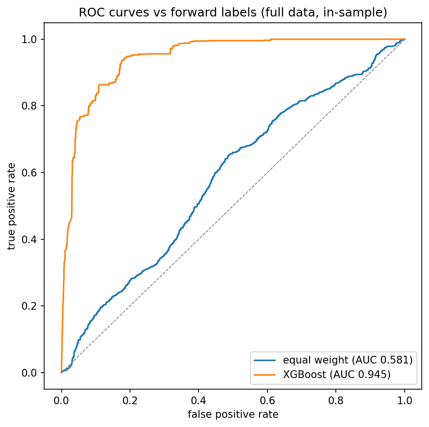
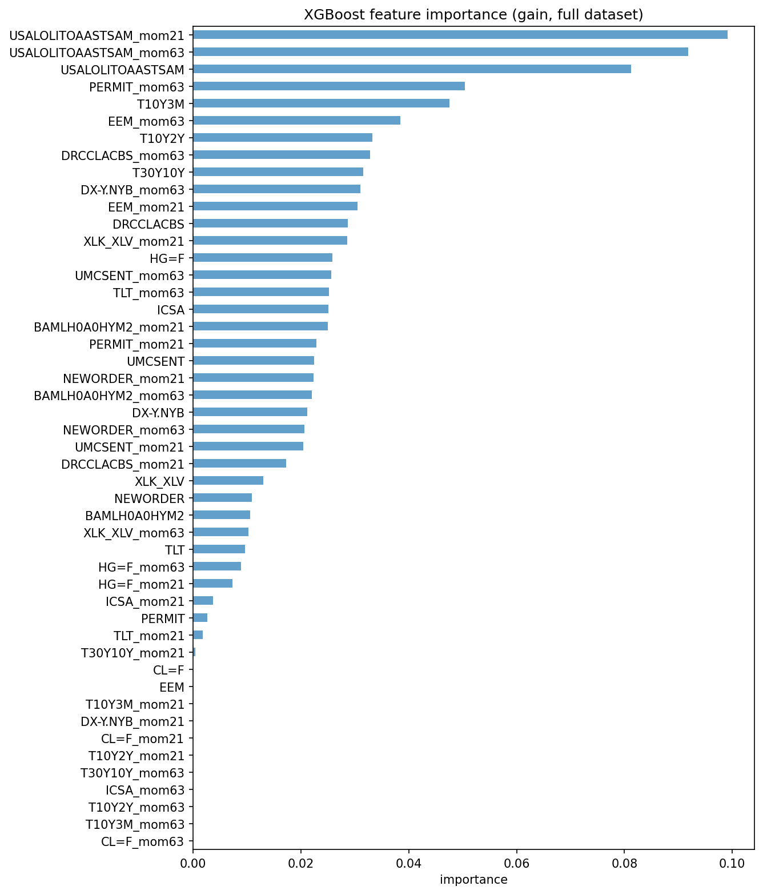
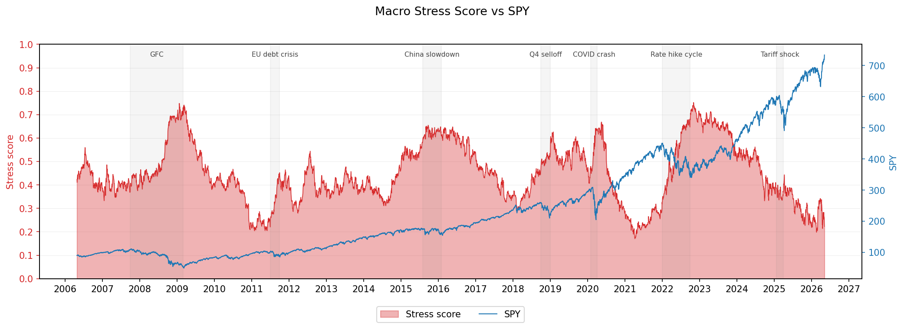
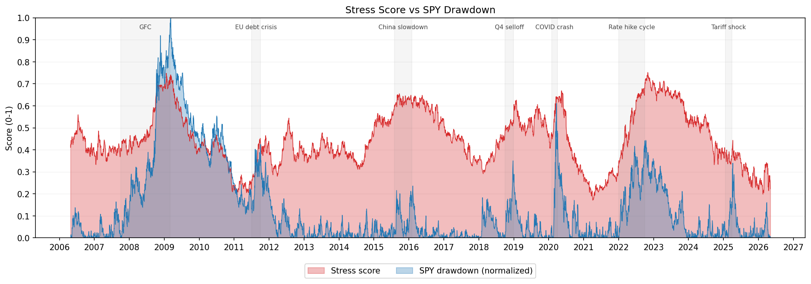
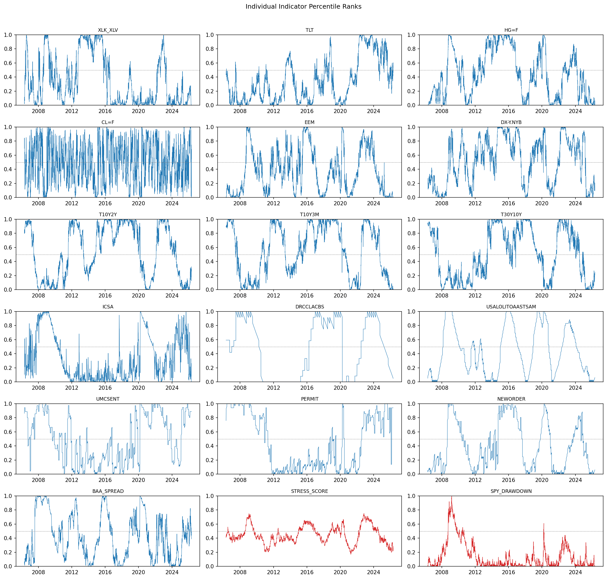

# macro-stress-forecaster

**Part 3 of 3:** [macro-stress-pipeline](https://github.com/JaredRudolph/macro-stress-pipeline) | [macro-stress-optimizer](https://github.com/JaredRudolph/macro-stress-optimizer) | macro-stress-forecaster

Third project in a three-part macro stress series. Reads `stress_score.parquet` from
[macro-stress-pipeline](https://github.com/JaredRudolph/macro-stress-pipeline), trains an
XGBoost classifier on forward SPY drawdown labels, and writes `forecast.parquet` with a
per-day drawdown probability.

The series: [macro-stress-pipeline](https://github.com/JaredRudolph/macro-stress-pipeline)
&rarr; [macro-stress-optimizer](https://github.com/JaredRudolph/macro-stress-optimizer)
&rarr; **macro-stress-forecaster** (this repo)

## Results

The forecaster outputs a per-day probability that SPY will drop at least 8% at some point
in the next 60 trading days.



The probability signal elevated ahead of every major stress period in the sample: the GFC,
the 2011 EU debt crisis, the 2015-2016 China slowdown, the 2018 Q4 selloff, COVID, the 2022
rate hike cycle, and the 2025 tariff shock. The signal drops during sustained bull markets
and re-elevates as macro conditions deteriorate.



Overlaying the probability against the normalized SPY drawdown (both on a 0-1 scale) shows
how well the signal tracks realized drawdown severity. The probability tends to rise before
the drawdown deepens and fall before it recovers.

### Model performance



The ROC chart is computed on the full training dataset (in-sample), so the XGBoost AUC
reflects a model evaluated on data it was trained on. It is shown here to illustrate
separation from the equal-weight baseline, not as an honest generalization estimate.
Cross-validated AUC (5-fold `TimeSeriesSplit` with a 60-day gap) is the metric used for
model selection and is logged at runtime.

CV results show that recency weighting is the key lever. Without it, XGBoost (CV AUC 0.610)
underperforms the equal-weight baseline (0.650) — the model memorizes historical stress
regimes that do not transfer to recent periods. With a 504-day half-life, XGBoost reaches
CV AUC 0.658, modestly but consistently above the baseline across the stable folds. The most
recent fold (2022-2026) remains the hardest: the post-rate-hike and tariff-shock regime
differs structurally from the GFC and COVID patterns that dominate the training data.

### Feature importance



The OECD composite leading indicator (`USALOLITOAASTSAM`) dominates across both momentum
windows (21d and 63d) and the raw rank. This indicator is designed to lead the economic
cycle, so its rate-of-change being the strongest predictor is consistent with the forecasting
objective. `PERMIT` (building permits) 63-day momentum and the short-end yield spread
(`T10Y3M`) are the next most important features. The yield curve and market indicators
collectively provide useful signal, but no single one of them approaches the leading
indicator's importance.

The dominance of momentum features over raw rank features throughout the chart validates the
feature engineering choice: the direction and speed of deterioration matters more than the
current stress level.

## Input data

The forecaster reads `stress_score.parquet` produced by the pipeline. It contains the raw
SPY price, the equal-weight composite stress score, and the 16 percentile-ranked indicator
columns that serve directly as features.



The composite score is the equal-weight mean of the 16 ranked indicators. It elevates ahead
of sustained SPY drawdowns and retreats during bull markets.



Overlaying the stress score against the normalized SPY drawdown shows the score tends to lead
the drawdown, not just confirm it. This leading property is what the forecaster is designed
to exploit: the 16 indicators are selected because they reflect deteriorating macro conditions
before they show up in equity prices.

## Forecaster Design

### Labels

A day is labeled 1 if SPY drops at least 8% at any point within the next 60 trading days,
0 otherwise. The last 60 rows have no complete forward window and are dropped before training.

The 8% threshold and 60-day horizon were selected via a sweep over thresholds (5-20%) and
horizons (20-120 days) in `feature_engineering.ipynb`. The 60d/8% configuration produced the
largest momentum lift over the raw-rank baseline.

### Features

Raw percentile ranks for all 16 indicators plus 21-day and 63-day momentum per indicator
(rank minus its lagged value), giving 48 features total.

Feature families tested before settling on this set:

| Feature family | Result |
|---|---|
| Raw ranks (baseline) | AUC ~0.52 |
| Raw ranks + lags (5d, 21d, 63d) | No improvement; adds noise |
| Raw ranks + momentum (21d, 63d) | Best result; consistent lift |
| Raw ranks + breadth (share above 6-month mean) | No improvement |
| Momentum + breadth-of-momentum | Degraded momentum AUC |
| Momentum + rolling volatility | No improvement |
| Momentum + SPY current drawdown level | No improvement |

With roughly 938 positive events in the training set, adding feature families beyond momentum
dilutes the signal. The model does not have enough positive examples to benefit from the
additional information.

### Model

XGBoost (`XGBClassifier`) trained on the 48 momentum features with exponential recency
weighting. A linear weighted composite was explored first and abandoned: test AUC sat near
0.5 on forward labels, below the equal-weight baseline.

`scale_pos_weight = n_neg / n_pos` corrects for class imbalance (~19% drawdown events).

### Recency weighting

Per-fold CV analysis revealed that XGBoost without recency weighting (CV AUC 0.610)
underperforms the equal-weight baseline (0.650). The gap is not uniform across folds —
fold 5 (2022-2026) drives most of it, with test AUC near random chance. The model memorizes
GFC and COVID stress patterns and misapplies them to a structurally different regime
(post-rate-hike recovery, AI bull market, tariff shock).

Exponential decay sample weights assign each training sample a weight relative to the end of
its training fold:

```
w(t) = exp(-ln(2) / half_life * days_back)
```

Most recent sample = 1.0, weight halves every `half_life` calendar days. Weights are computed
per fold so each fold's training set is weighted relative to its own end date. A half-life of
504 days (2 years) was selected via CV sweep — it improves mean CV AUC to 0.658, recovering
fold 4 (+0.156) and fold 5 (+0.043) without significantly hurting the stable middle folds.
Without recency weighting, XGBoost does not justify its complexity over the equal-weight
baseline.

### Hyperparameter tuning

Parallel sweep over `n_estimators` (75, 100, 150, 200, 300), `learning_rate`
(0.005, 0.01, 0.02), `reg_alpha` (0.1, 1.0, 5.0), `reg_lambda` (1.0, 5.0), and `half_life`
(126, 252, 504, None) using `joblib.Parallel` (360 combinations total). Each combination is
evaluated via 5-fold time series CV. Selection criterion: `mean_auc - std_auc`, which
penalizes variance across folds rather than optimizing for peak AUC. `max_depth` is fixed
at 2 to limit overfitting given the sample size.

### Leakage prevention

`TimeSeriesSplit(n_splits=5, gap=60)` skips 60 samples between each train and test fold.
Without the gap, a fold's training labels could include days whose forward window overlaps
with the test period, leaking future information.

### Metrics

AUC and Brier score, evaluated via CV. Baseline is the equal-weight stress score (mean of
the 16 ranked indicator columns) evaluated against the same forward labels and CV splits.
CV metrics are stored in `forecast.parquet` metadata on each run.

## Architecture

```
Pipeline
  fetch_data.py      pulls yfinance + FRED
  process_data.py    merges, resamples, computes ratios
  features.py        rolling percentile rank, direction flip, composite score
  pipeline.py        orchestration, writes stress_score.parquet

                     data/processed/stress_score.parquet
                                      |
                                      v
Optimizer
  labels.py          coincident SPY drawdown labels
  optimizer.py       SLSQP weight optimization, alpha sweep, CV evaluation

                     data/processed/optimized_weights.json
                                      |
                                      v
Forecaster
  labels.py          forward SPY drawdown labels (lookahead=60, threshold=8%)
  forecaster.py      48 momentum features, 360-combo hyperparameter sweep,
                     XGBoost with recency weighting, writes forecast.parquet
```

All three packages are installed from `src/` via `pyproject.toml`. The forecaster does not
import from `macro_stress_optimizer` or `macro_stress_pipeline`. The parquet file is the
only interface between the pipeline and ML layers.

## Indicators

**Yield curve (FRED)**
| Series | Indicator |
|---|---|
| `T10Y2Y` | 10Y-2Y Treasury spread |
| `T10Y3M` | 10Y-3M Treasury spread |
| `T30Y10Y` | 30Y-10Y Treasury spread (computed: `DGS30 - DGS10`) |

**Macro leading (FRED)**
| Series | Indicator |
|---|---|
| `USALOLITOAASTSAM` | OECD composite leading indicator |
| `UMCSENT` | University of Michigan consumer sentiment |
| `PERMIT` | Building permits |
| `NEWORDER` | Manufacturers new orders |

**Labor and credit (FRED)**
| Series | Indicator |
|---|---|
| `ICSA` | Initial jobless claims |
| `DRCCLACBS` | Credit card delinquency rate |
| `BAMLH0A0HYM2` | ICE BofA HY OAS spread |

**Market (yfinance)**
| Ticker | Indicator |
|---|---|
| `XLK` / `XLV` | Tech vs defensive rotation |
| `TLT` | Long-duration Treasury ETF |
| `HG=F` | Copper futures (growth proxy) |
| `CL=F` | Crude oil futures (rate-of-change; dual stress regime) |
| `EEM` | Emerging markets ETF |
| `DX-Y.NYB` | DXY dollar index |

Each indicator is percentile-ranked over a 756-day rolling window and direction-flipped so
that 1.0 always means maximum stress. The first 755 rows of each ranked column are NaN
(warmup period).



## Setup

Requires [uv](https://docs.astral.sh/uv/).

```bash
git clone https://github.com/JaredRudolph/macro-stress-forecaster.git
cd macro-stress-forecaster
uv sync
```

FRED requires a free API key. Create a `.env` file in the project root:

```
FRED_API_KEY=your_key_here
```

Get a key at [fred.stlouisfed.org](https://fred.stlouisfed.org/docs/api/api_key.html).

```bash
uv run pytest        # run tests
uv run ruff check .  # lint
uv run ruff format . # format
```

## Usage

```bash
uv run stress-pipeline   # fetch data, compute stress score
uv run stress-optimize   # read parquet, optimize weights (coincident labels)
uv run stress-forecast   # read parquet, tune + train classifier, write forecast.parquet
```

The pipeline must run before the optimizer or forecaster. The optimizer and forecaster are
independent of each other and can run in either order.

Outputs:

- `data/raw/market_raw.csv`: raw yfinance closes
- `data/raw/fred_raw.csv`: raw FRED series
- `data/processed/stress_score.parquet`: stress score with all ranked indicators and SPY
- `data/processed/optimized_weights.json`: per-indicator weights optimized against coincident drawdown labels
- `data/processed/forecast.parquet`: original parquet columns plus `FORWARD_LABEL` and `DRAWDOWN_PROB`

`forecast.parquet` metadata includes `cv_auc`, `cv_brier`, `baseline_auc`, and `best_params`
from the tuning run.

## Notebooks

Start with `notebooks/forecaster_xgb.ipynb` for the full forecaster workflow.

- `notebooks/forecaster_xgb.ipynb`: momentum feature construction, hyperparameter sweep,
  per-fold CV diagnosis, recency weighting sweep (hl=504 selected), regularization sweep,
  feature importance, and probability visualization.
- `notebooks/feature_engineering.ipynb`: systematic sweep over feature families (lags,
  momentum, breadth, volatility, SPY drawdown) and label configurations (lookahead 20-120d,
  threshold 5-20%). Concludes that raw ranks + 21d/63d momentum and 60d/8% labels are the
  best setup at this sample size.
- `notebooks/forecaster.ipynb`: initial attempt using logistic regression and weight
  re-optimization. Abandoned after test AUC failed to clear the equal-weight baseline.
